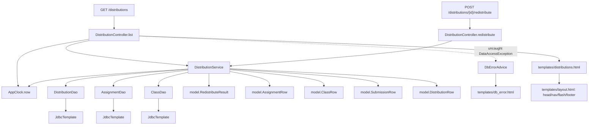
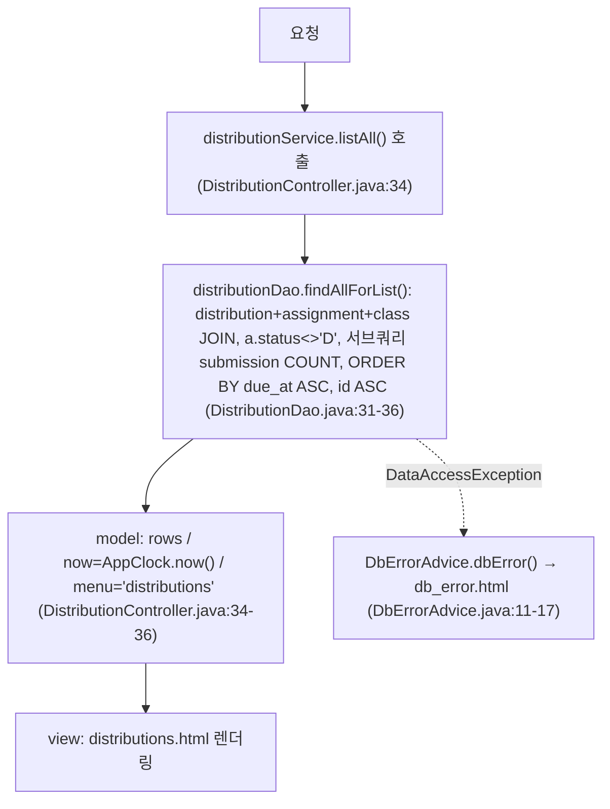
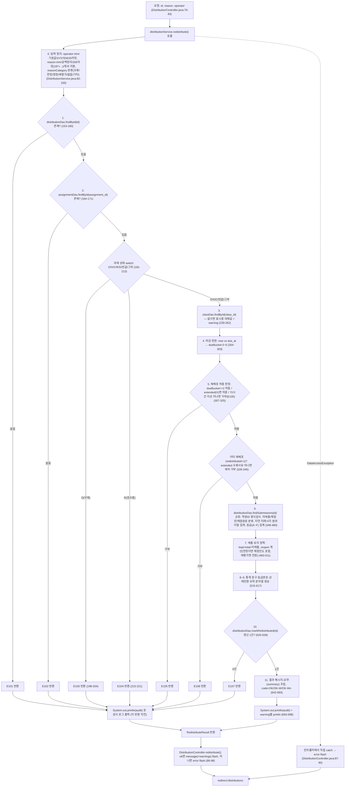

# assignment-thymeleaf 아키텍처 분석 — 배포 목록 화면

> 대상: `legacy/assignment-thymeleaf` (Spring Boot MVC · Thymeleaf, MariaDB `itembank` 스키마 공유)
> **범위 제한**: 이 문서는 모듈 전체가 아니라 **"배포 목록" 화면(`GET /distributions`)과 그 화면이 호출하는 코드만** 다룬다. 같은 화면 안의 재배포 버튼이 호출하는 `POST /distributions/{id}/redistribute`도 포함한다. "새 배포 등록" 화면(`GET /distributions/new`, `POST /distributions`)과 "과제 목록" 화면(`GET /assignments`)은 별도 화면이므로 범위 밖이며, 이 문서에서는 존재만 언급하고 내부 로직은 분석하지 않는다.
> 이 문서는 실제로 읽은 파일에서 확인한 내용만 담는다. 읽지 않은 부분은 "미확인 목록"에 남긴다.

## 화면 개요

- "배포 목록" 화면은 `GET /distributions`로 접근하며 `DistributionController.list()`가 `distributions.html`을 렌더링한다. 배포된 과제 목록(과제명·학급·배포시각·재배포 여부·제출 수)을 보여준다.
- 같은 화면 표의 각 행에는 조건부로 "재배포" 버튼(인라인 폼)이 있고, 제출하면 `POST /distributions/{id}/redistribute`를 호출해 같은 화면(`/distributions`)으로 리다이렉트된다. 이 재배포 처리 로직(`DistributionService.redistribute()`)이 이 화면에서 가장 복잡한 부분이다.
- 컨트롤러 → 서비스 → DAO(JdbcTemplate) 3계층 구조이며, 서비스 계층에 SQL은 없고 DAO 계층에만 SQL 문자열이 있다.
- DB 접속은 `application.properties`상 `jdbc:mariadb://localhost:3306/itembank` 기본값을 쓰며, `legacy/item-bank-php`와 같은 스키마(`itembank`)를 공유한다(db/mariadb/init/01-schema.sql:73 주석 "assignment-thymeleaf 모듈이 같은 DB를 쓴다").
- 시간 기준은 `AppClock.now()`를 통해서만 얻는다 — 소스 주석(AppClock.java:8)에 따르면 "2024-03 QA 기간 중 임시로 고정"된 값(`2026-09-15 00:00:00`)이며, 시스템 프로퍼티 `app.clock=system`을 주면 실제 시각으로 바뀐다.
- 예외 처리: 컨트롤러가 직접 잡지 않는 `DataAccessException`은 전역 `@ControllerAdvice`(`DbErrorAdvice`)가 받아 `db_error.html`을 렌더링한다. `redistribute()`는 컨트롤러 단에서 `DataAccessException`을 직접 잡아 플래시 에러 메시지로 처리하므로 이 경로에서는 `DbErrorAdvice`가 호출되지 않는다.

## 폴더 구조 (범위 내 파일만)

```
legacy/assignment-thymeleaf/
├── src/main/java/com/example/assign/
│   ├── AppClock.java                     고정 시각 제공 (now, fmt) — 14줄+주석
│   ├── web/
│   │   ├── DistributionController.java   /distributions, /distributions/{id}/redistribute 등 (list·redistribute만 범위)
│   │   └── DbErrorAdvice.java            전역 DataAccessException → db_error.html
│   ├── service/
│   │   └── DistributionService.java      listAll(), redistribute() (범위 내 핵심 로직, 701줄 파일 중 redistribute가 대부분)
│   ├── dao/
│   │   ├── DistributionDao.java          distribution/submission SQL
│   │   ├── AssignmentDao.java            assignment(+unit LEFT JOIN) SQL — redistribute()에서 findById만 사용
│   │   └── ClassDao.java                 class SQL — redistribute()에서 findById만 사용
│   └── model/
│       ├── DistributionRow.java, AssignmentRow.java, ClassRow.java, SubmissionRow.java  (getter/setter만 있는 값 객체)
│       └── RedistributeResult.java       redistribute() 결과(성공여부·코드·메시지·요약·notes·warnings)
└── src/main/resources/templates/
    ├── layout.html          head/nav/flash/footer 공통 조각 — distributions.html이 재사용
    ├── distributions.html   배포 목록 화면 본문 (범위)
    └── db_error.html        DbErrorAdvice가 그리는 오류 화면 (범위, 간접 호출)
```

범위 밖(존재만 확인, 내부 분석 안 함): `web/AssignmentController.java`, `service`의 `distribute()`(신규 배포 등록), `dao/AssignmentDao.findAllForSelect()`, `templates/assignments.html`, `templates/distribution_form.html`.

## 진입점 표

| 진입점 | HTTP 메서드 | 역할 | 호출 의존 | 근거 |
|---|---|---|---|---|
| `DistributionController.list()` (`GET /distributions`) | GET | 배포 목록 화면 렌더링 | `DistributionService.listAll()`, `AppClock.now()` | DistributionController.java:32-38 |
| `DistributionController.redistribute()` (`POST /distributions/{id}/redistribute`) | POST | 화면 내 재배포 버튼 처리 후 `/distributions`로 리다이렉트 | `DistributionService.redistribute()` | DistributionController.java:79-100 |
| `DbErrorAdvice.dbError()` (전역 `@ExceptionHandler`) | — | `list()`에서 `DataAccessException`이 새 나가면 대신 처리 | 없음(모델에 에러 메시지만 채움) | DbErrorAdvice.java:11-17 |

## 의존 관계



`DistributionController`는 `AssignmentDao`·`ClassDao`도 생성자 주입받지만(DistributionController.java:23-24), 범위 내 두 메서드(`list`, `redistribute`)에서는 사용하지 않는다 — `form()`/`create()`(범위 밖, `/distributions/new`·`POST /distributions`)에서만 쓰인다.

### DB 호출 표

| 파일:함수 | 대상 테이블 | 종류 | 근거 |
|---|---|---|---|
| `DistributionDao.findAllForList()` | `distribution` JOIN `assignment` JOIN `` `class` ``, 서브쿼리로 `submission` COUNT | SELECT | DistributionDao.java:31-36 |
| `DistributionDao.findById()` | 위와 동일 4테이블 조합(단건) | SELECT | DistributionDao.java:38-44 (redistribute()에서 갱신 전/후 2회 호출) |
| `DistributionDao.findSubmissions()` | `submission` | SELECT | DistributionDao.java:69-73 |
| `DistributionDao.markRedistributed()` | `distribution` | UPDATE | DistributionDao.java:65-67 |
| `AssignmentDao.findById()` | `assignment` LEFT JOIN `unit`, 서브쿼리로 `distribution` COUNT DISTINCT | SELECT | AssignmentDao.java:41-48 (redistribute()에서 호출) |
| `ClassDao.findById()` | `` `class` `` | SELECT | ClassDao.java:24-30 (redistribute()에서 호출) |

`DistributionDao.countByAssignmentAndClass()`, `nextId()`, `insert()`(DistributionDao.java:47-63)와 `AssignmentDao.findAllForSelect()`(AssignmentDao.java:34-39)는 범위 밖 화면(새 배포 등록)에서만 쓰여 이 표에서 제외했다.

## 파일별 기능 흐름

### GET /distributions (목록)



`now` 모델 속성은 컨트롤러에서 넘기지만(DistributionController.java:35) `distributions.html`에서 실제로 참조되는 곳은 없다 — 템플릿에는 `${now}` 사용이 없다.

### POST /distributions/{id}/redistribute (화면 내 재배포 버튼)

`DistributionService.redistribute()`(DistributionService.java:71-700)는 이 화면에서 가장 복잡한 로직이다. 주요 분기만 나타낸다.



## 미확인 목록

- `db/mariadb/init/01-schema.sql:87` 주석은 `assignment.status`를 "O=진행 C=마감" 두 값만 문서화하지만, `DistributionService.redistribute()`의 switch(DistributionService.java:181-213)는 `X`(연장)·`R`(검수중)·`D`(삭제)·빈 값·그 외 값까지 처리한다 — 이 상태값들이 실제로 어디서 세팅되는지(다른 모듈? 수동 갱신?)는 이 화면 범위에서 확인하지 못했다.
- `submission.submitted_at`은 스키마상 `NOT NULL`(01-schema.sql:109)인데, `DistributionService.redistribute()`는 `at == null`인 경우를 별도로 분기 처리한다(DistributionService.java:407-415, 423 등) — 실제 데이터에 NULL이 존재할 수 있는지, 아니면 방어적으로만 짜인 코드인지는 확인하지 못했다.
- `AssignmentDao.findById()`가 LEFT JOIN하는 `unit` 테이블 데이터(`unit_code`, `unit_name`)는 `redistribute()` 로직에서 조회는 되지만 실제로 쓰이는 곳이 없다(AssignmentRow에 담기기만 함) — 사용 여부를 코드에서 재확인함, 결과 메시지·summary 어디에도 unit 관련 필드 참조 없음.
- `DistributionController` 생성자가 주입받는 `AssignmentDao`·`ClassDao`(범위 밖 `form()`/`create()`용)의 내부 로직은 이 문서에서 분석하지 않았다.
- `redistribute()` 안의 `System.out.println` 감사 로그(DistributionService.java:158, 169, 203, 219, 343, 625, 693-698)가 CLAUDE.md 로깅 규칙(SLF4J만 사용)과 다른 것은 레거시 코드 특성으로만 기록하고, 이 문서에서는 사실 확인만 한다(개선 제안은 범위 밖).
