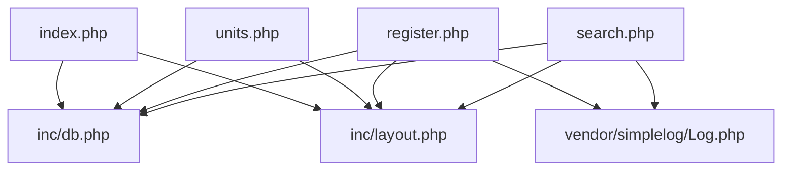
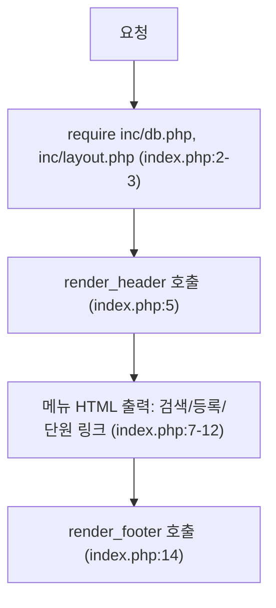
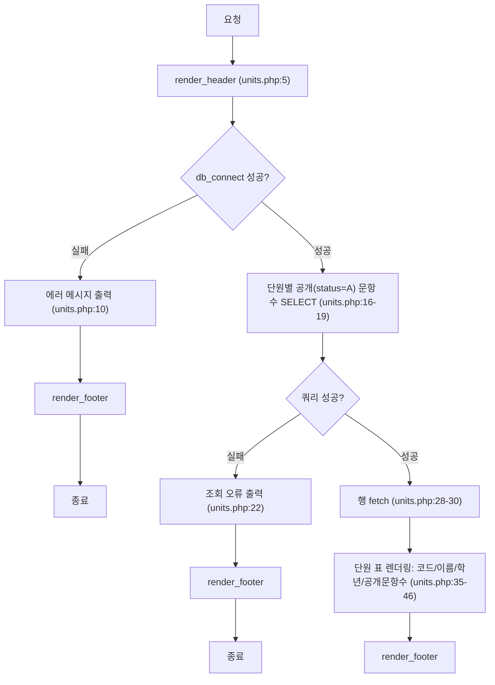
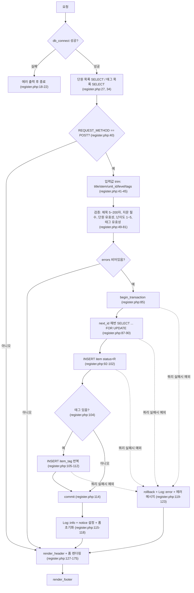

# item-bank-php 아키텍처 분석

> 대상: `legacy/item-bank-php` (PHP 7.4 · mysqli, 라우터/프레임워크 없음)
> 이 문서는 실제로 읽은 파일에서 확인한 내용만 담는다. 읽지 않은 부분은 "미확인 목록"에 남긴다.

## 모듈 개요

- PHP 7.4 + Apache + mysqli로 만든 레거시 문항 은행 웹 앱이며, 별도 라우터 없이 `index.php` · `search.php` · `register.php` · `units.php` 4개 파일이 각각 독립된 웹 진입점이다.
- 공통 기능(DB 연결, HTML 이스케이프, 헤더/푸터)은 `inc/db.php`, `inc/layout.php`에 함수로 분리되어 있고 각 진입점이 `require_once`로 불러온다.
- 검색 화면은 `v_item_public`이라는 DB 뷰를 통해 조회하고, 등록 화면은 신규 문항을 `status='R'`(검수중)로 저장해 검수 완료 전까지 검색에 노출하지 않는다.
- 로깅은 `vendor/simplelog`(더미 서드파티, 코드 주석에 "수정하지 말 것"이라 명시됨)를 통해 `error_log`로만 남기고 화면에는 출력하지 않는다.
- 인증/세션 처리 코드는 4개 진입점 어디에도 없다.

## 폴더 구조

```
legacy/item-bank-php/
├── Dockerfile              PHP 7.4-apache, mysqli 확장 설치, UTF-8/에러 로그 설정
├── index.php               홈 화면 — 메뉴 링크만 출력 (14줄)
├── search.php              문항 검색 화면 (731줄)
├── register.php            문항 등록 화면 — GET 폼 / POST 처리 (177줄)
├── units.php               단원 목록 화면 (48줄)
├── inc/
│   ├── db.php              db_connect(), h() — DB 연결 · HTML 이스케이프 (37줄)
│   └── layout.php          render_header(), render_footer() — 공통 레이아웃 (43줄)
└── vendor/simplelog/
    └── Log.php             더미 로깅 라이브러리, error_log 전용 (55줄)
```

## 진입점 표

| 파일 | HTTP 메서드 | 역할 | require 의존 | 근거 |
|---|---|---|---|---|
| `index.php` | GET | 홈 화면, 세 메뉴로 링크 | `inc/db.php`, `inc/layout.php` | index.php:2-3 |
| `units.php` | GET | 단원별 공개(`status='A'`) 문항 수 목록 | `inc/db.php`, `inc/layout.php` | units.php:2-3, 16-17 |
| `search.php` | GET | 문항 검색(키워드·단원·난이도·태그·정렬·페이지) | `inc/db.php`, `inc/layout.php`, `vendor/simplelog/Log.php` | search.php:20-22 |
| `register.php` | GET(폼 표시) / POST(등록 처리) | 문항 등록, 저장 시 `status='R'`(검수중) | `inc/db.php`, `inc/layout.php`, `vendor/simplelog/Log.php` | register.php:2-4, 84, 94 |

## 의존 관계



### DB 호출 표

| 파일:함수 | 대상 테이블/뷰 | 종류 | 근거 |
|---|---|---|---|
| `units.php` (최상위) | `unit`, `item`(상관 서브쿼리) | SELECT | units.php:16-19 |
| `register.php` (최상위, GET) | `unit`, `tag` | SELECT | register.php:27, 34 |
| `register.php` (최상위, POST) | `item`, `item_tag` | SELECT(id 채번, `FOR UPDATE`) + INSERT (트랜잭션) | register.php:85-114 |
| `search.php buildSearchQuery()` | `unit`, `tag` | SELECT (선택 목록/단원명 조회) | search.php:125, 156, 178 |
| `search.php buildSearchQuery()` / `runSearchQuery()` | `v_item_public` | SELECT (건수 + 페이지 조회) | search.php:521-526, 577, 600 |

`inc/db.php`의 `h()`는 `inc/layout.php`와 모든 화면 파일에서 이스케이프 용도로 공유돼 쓰인다(예: layout.php:17, units.php:40-43, search.php 다수 지점).

## 파일별 기능 흐름

파일 간 require 관계가 아니라, 각 파일 안에서 함수 호출 · 분기가 어떻게 이어지는지를 나타낸다.

### index.php



### units.php



### register.php



### search.php

```mermaid
flowchart TD
    A["요청 GET (search.php:709)"] --> B[render_header]
    B --> C{"db_connect 성공?"}
    C -- 실패 --> C1["에러 출력 (search.php:715-716)"] --> Z[render_footer 후 종료]
    C -- 성공 --> D["buildSearchQuery 호출 (search.php:722)"]

    subgraph BQ["buildSearchQuery (search.php:42-564)"]
        D1["GET 파라미터 추출: q/unit/level/tag/sort/dir/page (52-80)"] --> D2["키워드 q 처리: LIKE 조건 + 100자 컷 + 와일드카드 경고 (84-104)"]
        D2 --> D3["단원 unit 처리: 형식검증 + 단원명 조회로 존재확인 (109-147)"]
        D3 --> D4["선택목록 구성: 단원/태그/난이도 옵션 (152-206)"]
        D4 --> D5{"level 값? (211)"}
        D5 -- 빈값 --> D5a["AND level < 5 (213-216)"]
        D5 -- "1~5" --> D5b["AND level = ? (217-222)"]
        D5 -- 그외 --> D5c["그대로 정수 비교 + 경고 (223-230)"]
        D5a --> D6
        D5b --> D6
        D5c --> D6
        D6["태그 tag 처리: EXISTS 서브쿼리 + 등록여부 확인 (235-261)"] --> D7["정렬 sort/dir 분기 (266-331)"]
        D7 --> D8["페이지 page 검증 1~999 (336-349)"]
        D8 --> D9["요약/폼HTML/정렬링크/페이지링크 생성 (352-516)"]
        D9 --> D10["최종 SQL 조립: v_item_public 대상 (518-526)"]
        D10 --> D11{"bind 타입수 == 값개수? (536)"}
        D11 -- 불일치 --> D11a["RuntimeException (538)"]
        D11 -- 일치 --> D12["built 배열 반환 (541-563)"]
    end

    D --> E["renderSearchForm: 검색 폼 출력 (723)"]
    E --> F["runSearchQuery 호출 (724)"]

    subgraph RQ["runSearchQuery (search.php:571-624)"]
        F1["count_sql 준비+바인딩+실행 → total (577-597)"] --> F2["sql 준비+바인딩+실행 → rows (600-621)"]
    end

    F --> G["renderResultTable 호출 (725)"]

    subgraph RT["renderResultTable (search.php:647-704)"]
        G1["경고/요약 출력 (652-653)"] --> G2["count 출력 (655)"]
        G2 --> G3{"total == 0? (657)"}
        G3 -- 예 --> G3a["결과없음 메시지 후 종료 (658-659)"]
        G3 -- 아니오 --> G4["표 헤더(정렬링크) + 행 출력 (663-681)"]
        G4 --> G5["페이지네이션 링크, 총 페이지 > 1인 경우 (684-703)"]
    end

    D11a -. RuntimeException .-> X["catch: Log::error + 에러 메시지 (726-728)"]
    F1 -. RuntimeException .-> X
    F2 -. RuntimeException .-> X
    G --> H[render_footer]
    X --> H
```



## 가장 긴 함수 3개

| 순위 | 함수 | 위치 | 길이 | 비고 |
|---|---|---|---|---|
| 1 | `buildSearchQuery` | search.php:42-564 | 523줄 | GET 파라미터 파싱·검증, SQL WHERE 조립, 정렬/페이지 계산, 폼 HTML 생성까지 한 함수에서 처리 |
| 2 | `renderResultTable` | search.php:647-704 | 58줄 | 결과 표 + 페이지 링크 출력 |
| 3 | `runSearchQuery` | search.php:571-624 | 54줄 | 건수 조회 + 현재 페이지 행 조회 (bind_param 두 번 반복) |

`index.php`, `register.php`, `units.php`는 함수로 분리되지 않은 절차형 스크립트라 이 집계에서 제외했다(최상위 스크립트 본문 자체는 함수가 아님).

## 미확인 목록

- `search.php:213-216`: `level`이 빈 값일 때 주석은 "전체 난이도 검색 (1~5 모두 포함)"이라고 돼 있지만 실제 조건은 `AND level < 5`로 `level=5`인 문항을 제외한다. 의도된 동작인지 버그인지 확인 안 함.
- `item`, `unit`, `tag`, `item_tag` 테이블의 전체 컬럼 정의와 `status` 코드값 전체 목록(`'A'`, `'R'` 외 다른 값 존재 여부)은 확인 안 함.
- `Dockerfile` 외의 배포/런타임 구성(예: 루트 `docker-compose.yml`의 이 서비스 설정, 환경변수 주입 방식)은 읽지 않음.
- 인증/권한 체크가 코드에 없는데, 별도 인증 계층(리버스 프록시 등)이 앞단에 있는지는 확인 안 함.
- `vendor/simplelog/Log.php`는 내부 구현만 훑었고, 운영 환경에서 실제 서드파티 패키지로 교체되는지는 확인 안 함.
