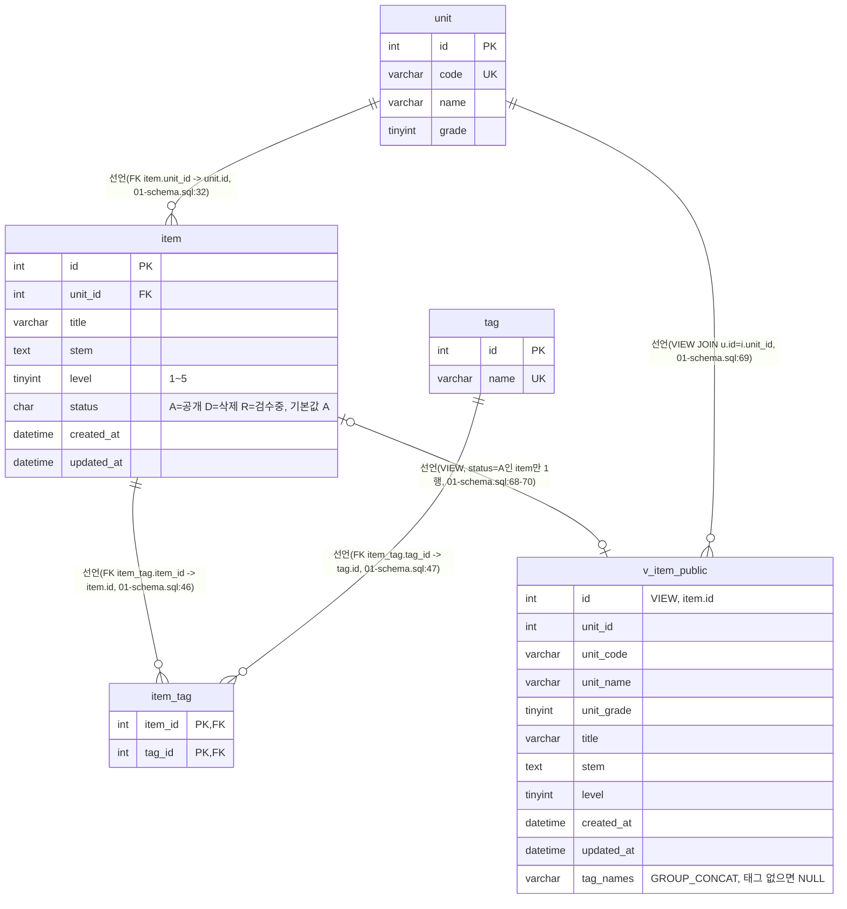

# item-bank-php 데이터 흐름 (ERD)

> 대상: `legacy/item-bank-php`
> 근거 자료: `docs/item-bank/ARCHITECTURE.md`(먼저 읽음), `db/mariadb/init/01-schema.sql`(스키마 정의), `legacy/item-bank-php` 소스
> `inc/db.php:14-18`의 기본 접속값(`DB_HOST=mariadb`, `DB_NAME=itembank`)이 `db/mariadb/init/01-schema.sql:5`의 `itembank` 스키마와 이름이 일치해 이 스키마를 근거로 삼았다. 실제 배포(compose)에서 이 파일이 마운트되는지는 "미확인" 항목에 남긴다.

## 1. 테이블 목록

| 테이블 | 주요 컬럼 | 근거 |
|---|---|---|
| `unit` | `id` PK, `code` VARCHAR(16) UNIQUE, `name` VARCHAR(100), `grade` TINYINT | db/mariadb/init/01-schema.sql:11-18 |
| `item` | `id` PK, `unit_id` INT FK→unit.id, `title` VARCHAR(200), `stem` TEXT, `level` TINYINT(1~5), `status` CHAR(1) 기본값 'A'(A=공개, D=삭제, R=검수중), `created_at`/`updated_at` DATETIME | db/mariadb/init/01-schema.sql:20-33 |
| `tag` | `id` PK, `name` VARCHAR(50) UNIQUE | db/mariadb/init/01-schema.sql:35-40 |
| `item_tag` | `item_id` INT FK→item.id, `tag_id` INT FK→tag.id, 복합 PK(item_id, tag_id) | db/mariadb/init/01-schema.sql:42-48 |
| `v_item_public` (VIEW) | `id`, `unit_id`, `unit_code`, `unit_name`, `unit_grade`, `title`, `stem`, `level`, `created_at`, `updated_at`, `tag_names`(GROUP_CONCAT, 태그 없으면 NULL) — `item JOIN unit`, `status='A'`인 행만 | db/mariadb/init/01-schema.sql:52-70 |

같은 스키마 파일에 `class`, `assignment`, `distribution`, `submission` 테이블도 정의돼 있지만(db/mariadb/init/01-schema.sql:75-115), 스키마 주석(01-schema.sql:73 "assignment-thymeleaf 모듈이 같은 DB를 쓴다")과 `legacy/item-bank-php` 소스 전체를 확인한 결과 이 모듈의 어떤 파일도 이 4개 테이블을 참조하지 않는다. 따라서 아래 다이어그램·표에서 제외했다.

## 2. 테이블 관계

이 모듈(`legacy/item-bank-php`)의 PHP 코드가 실행하는 JOIN·서브쿼리(예: search.php:244-245의 `item_tag`↔`tag` EXISTS 서브쿼리)는 모두 위에서 이미 "선언"된 FK/뷰 관계와 같은 컬럼 쌍을 사용한다. 스키마에 없는 컬럼으로 코드가 독자적으로 연결하는("추정") 관계는 찾지 못했다.

## 3. 읽기 · 쓰기 위치 표

| 테이블/뷰 | 구분 | 파일:함수 | 근거 |
|---|---|---|---|
| `unit` | 읽기(SELECT) | `units.php`(최상위) — 단원 목록 + 공개 문항 수 서브쿼리 | units.php:16-19 |
| `unit` | 읽기(SELECT) | `register.php`(최상위, GET) — 선택 목록 | register.php:27 |
| `unit` | 읽기(SELECT) | `search.php buildSearchQuery()` — 단원 코드로 이름 조회, 선택 목록 | search.php:125, 156 |
| `unit` | 쓰기 | 없음 — 이 모듈에서 `unit`에 쓰는 코드 없음 | — |
| `item` | 읽기(SELECT) | `units.php`(최상위) — `status='A'` 문항 수 COUNT 서브쿼리 | units.php:17 |
| `item` | 읽기(SELECT, 잠금) | `register.php`(최상위, POST) — 다음 id 채번(`FOR UPDATE`) | register.php:87 |
| `item` | 읽기(간접, VIEW 경유) | `search.php buildSearchQuery()`/`runSearchQuery()` — `v_item_public` 조회 시 기반 테이블로 포함 | search.php:521-526, 577, 600; db/mariadb/init/01-schema.sql:68 |
| `item` | 쓰기(INSERT) | `register.php`(최상위, POST) — 신규 문항 저장(`status='R'`) | register.php:92-102 |
| `item` | 쓰기(UPDATE/DELETE) | 없음 — 이 모듈에서 `item`을 수정·삭제하는 코드 없음 | — |
| `tag` | 읽기(SELECT) | `register.php`(최상위, GET) — 선택 목록 | register.php:34 |
| `tag` | 읽기(SELECT) | `search.php buildSearchQuery()` — 선택 목록 | search.php:178 |
| `tag` | 읽기(간접, VIEW 경유) | `v_item_public.tag_names` 산출용 서브쿼리 | db/mariadb/init/01-schema.sql:64-66 |
| `tag` | 쓰기 | 없음 — 이 모듈에서 `tag`에 쓰는 코드 없음 | — |
| `item_tag` | 읽기(EXISTS) | `search.php buildSearchQuery()` — 태그 조건 필터 | search.php:244-245 |
| `item_tag` | 읽기(간접, VIEW 경유) | `v_item_public.tag_names` 산출용 서브쿼리 | db/mariadb/init/01-schema.sql:64-66 |
| `item_tag` | 쓰기(INSERT) | `register.php`(최상위, POST) — 선택한 태그 저장(반복 INSERT) | register.php:105-112 |
| `item_tag` | 쓰기(UPDATE/DELETE) | 없음 | — |
| `v_item_public` | 읽기(SELECT) | `search.php buildSearchQuery()` — SQL 조립 대상 | search.php:521-526 |
| `v_item_public` | 읽기(SELECT) | `search.php runSearchQuery()` — 건수·페이지 조회 실행 | search.php:577, 600 |
| `v_item_public` | 쓰기 | 불가능 — 뷰이므로 직접 쓰지 않음. 기반 테이블(`item`/`unit`/`item_tag`/`tag`) 변경이 자동 반영됨 | db/mariadb/init/01-schema.sql:52-70 |

## 4. 미확인

- `db/mariadb/init/01-schema.sql`이 `legacy/item-bank-php` 컨테이너가 실제로 연결하는 DB에 적용되는지는 `docker-compose.yml`을 읽지 않아 확인하지 못했다 — `inc/db.php` 기본값과 스키마 DB 이름이 같다는 점(둘 다 `itembank`, `mariadb`)으로만 추정했다.
- `02-seed.sql`, `03-users.sql`은 읽지 않았다 — 시드 데이터 내용과 DB 사용자 권한(예: `app` 계정이 이 테이블들에 대해 INSERT/SELECT 권한이 실제로 있는지)은 미확인.
- `item.status`에 `'A'`/`'D'`/`'R'` 외 다른 값이 실제로 쓰이는지는 스키마 주석(01-schema.sql:26)에 나열된 세 값 외에는 확인하지 못했다.
- `class`/`assignment`/`distribution`/`submission` 테이블은 스키마상 존재하지만 다른 모듈(assignment-thymeleaf) 소관으로 보고 이 문서에서 컬럼 상세는 분석하지 않았다.
